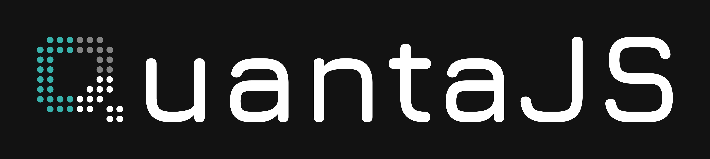

# QuantaJS Documentation Site



Welcome to the official documentation site for [QuantaJS](https://github.com/quanta-js/quanta), a compact, scalable, and developer-friendly state management library for JavaScript. This documetation site, built with Next.js and MDX, provides a sleek, responsive, and feature-rich experience to explore QuantaJS’s reactivity system, API, and guides all while the library is in its exciting beta phase

## 📦 Getting Started

### Prerequisites

- Node.js (v18 or higher recommended for Next.js 15)
- npm (v9 or higher)

### Installation

1. **Clone the Repository**:
   ```bash
   git clone https://github.com/quanta-js/quanta-docs.git
   cd quanta-docs
   ```
2. **Install Dependencies**:
    ```bash
    npm install
    ```

3. **Run Development Server**:
    ```bash
    npm run dev
    ```

    Open http://localhost:3000 to see the docs in action!

## 🌟 Contributing
We’re thrilled to have you onboard! To contribute:

1. Fork this repo.
2. Create a branch (git checkout -b feature/your-feature).
3. Commit changes (git commit -m "feat: add cool thing").
4. Push to your fork (git push origin feature/your-feature).
5. Open a Pull Request.


## ⭐ Support QuantaJS
Love what you see? Give the [QuantaJS](https://github.com/quanta-js/quanta) repo a star on GitHub and join the journey as we evolve this library together!
