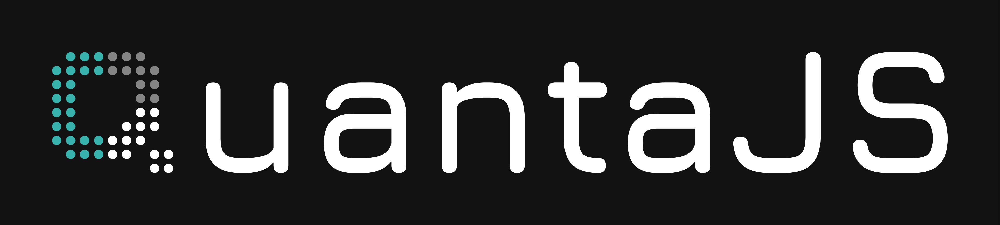

# QuantaJS Documentation Site



Welcome to the official documentation site for [QuantaJS](https://github.com/quanta-js/quanta), a compact, scalable, and developer-friendly state management library for JavaScript. This site documents the current QuantaJS **3.x** release line and is built with Next.js and MDX.

## 📦 Getting Started

### Prerequisites

- Node.js 22 or later
- npm 9 or later

### Installation

1. Clone the repository:
   ```bash
   git clone https://github.com/quanta-js/quanta-docs.git
   cd quanta-docs
   ```
2. Install dependencies:
   ```bash
   npm install
   ```
3. Start the development server:
   ```bash
   npm run dev
   ```

Open http://localhost:3000 to view the site.

## 🗂️ Site structure

Documentation pages live at:

```text
contents/docs/<section>/<page>/index.mdx
```

After adding a page, register it in `lib/routes-config.ts` so it appears in the sidebar and participates in previous/next navigation.

MDX files can use the components registered in `lib/markdown.ts`, including `Note`, `Tabs`, `TabsList`, `TabsTrigger`, `TabsContent`, `Stepper`, `StepperItem`, `Callout`, `Files`, and `Outlet`.

Blog posts live in `contents/blogs/`. Each post is an `.mdx` file with frontmatter for its title, description, date, authors, and cover image. Store referenced cover assets under `public/`.

## 🌟 Contributing

To contribute:

1. Fork this repository.
2. Create a branch: `git checkout -b feature/your-feature`.
3. Make your change and run the relevant checks, including `npm run build` for documentation/site changes.
4. Commit with a clear message.
5. Push your branch and open a pull request.

See the [Contributing page](https://quantajs.com/docs/contributing) for the content workflow.

Good first issues are available in both the [documentation repository](https://github.com/quanta-js/quanta-docs/issues?q=is%3Aissue%20is%3Aopen%20label%3A%22good%20first%20issue%22) and the [QuantaJS core repository](https://github.com/quanta-js/quanta/issues?q=is%3Aissue%20is%3Aopen%20label%3A%22good%20first%20issue%22).

## ⭐ Support QuantaJS

If QuantaJS is useful to you, consider starring the [QuantaJS repository](https://github.com/quanta-js/quanta).
